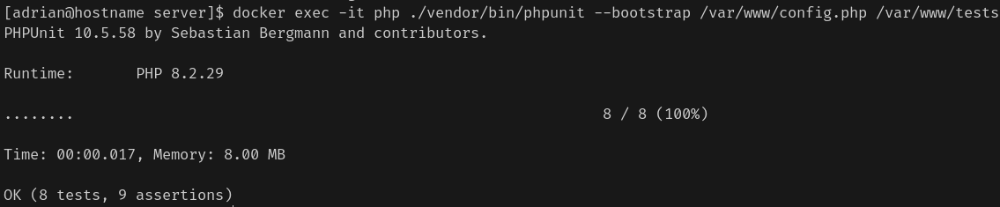

= Guía para la Ejecución de Tests - PesoFraya

== Introducción

Esta guía describe el procedimiento para ejecutar las pruebas automatizadas del proyecto **PesoFraya**, utilizando el framework **PHPUnit** dentro del entorno Docker configurado para el servidor.

El objetivo de los tests es garantizar el correcto funcionamiento de las clases principales del sistema (`User`, `UserController`, `Peso`, `PesoController`) y validar las operaciones sobre la base de datos.

== Requisitos Previos

Antes de ejecutar las pruebas, asegúrate que has seguido los pasos del manual de despliegue del servidor y tienes los contenedores Docker en funcionamiento.

Puedes comprobar el estado de los contenedores con:

[source, bash]
----
docker-compose ps
----

== Ejecución de Tests

Para ejecutar las pruebas unitarias, utiliza el siguiente comando desde la carpeta /server del proyecto:

[source, bash]
----
docker exec -it php ./vendor/bin/phpunit --bootstrap /var/www/config.php /var/www/tests
----

== Interpretación de Resultados

Aquí hay un ejemplo de cómo se verán los resultados tras ejecutar los tests:

Como se puede ver, los tests se ejecutan y muestran el número de pruebas realizadas, así como el tiempo de ejecución. Si todas las pruebas pasan correctamente, verás un mensaje indicando que no hubo fallos.